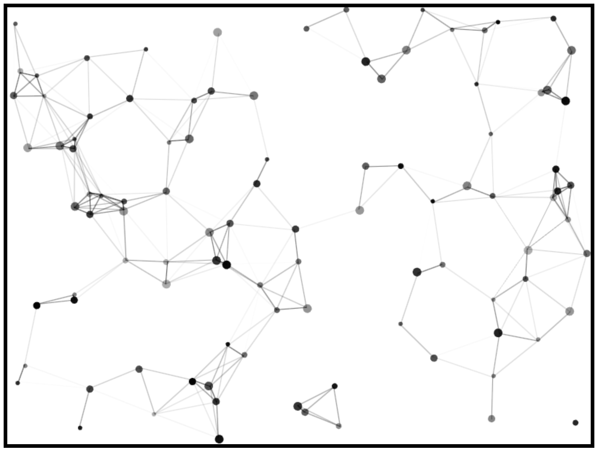

# Animated dots

This is a pet project utilizing plan canvas API and typescript to create connected bouncing dots animation.




# Usage

Open webpack dev server using

```
npm run serve
```

or create a static build in a `/dist` folder

```
npm run build
```

